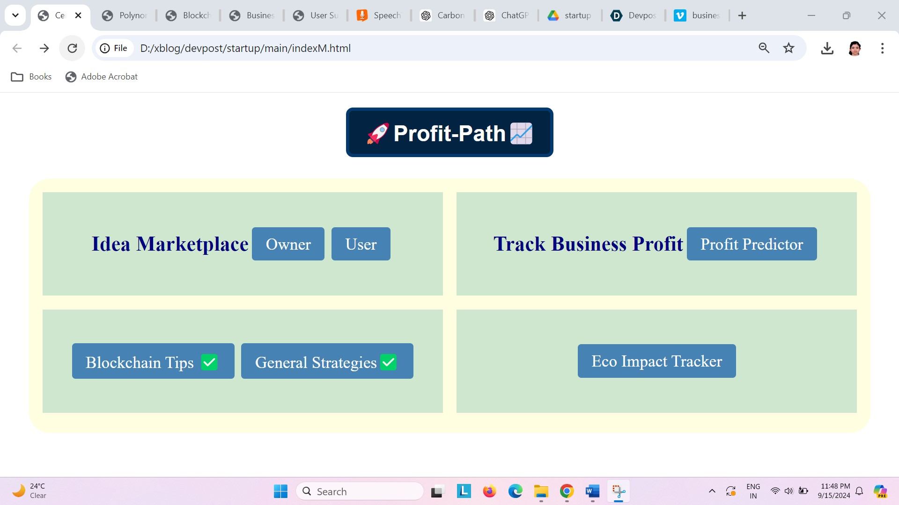
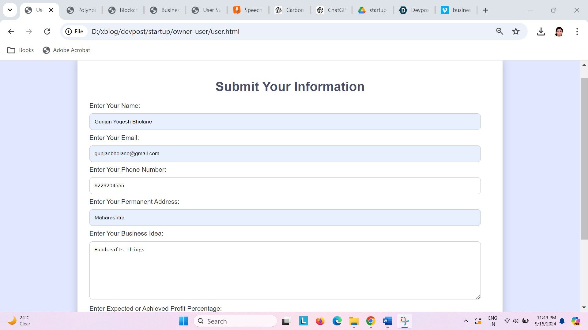
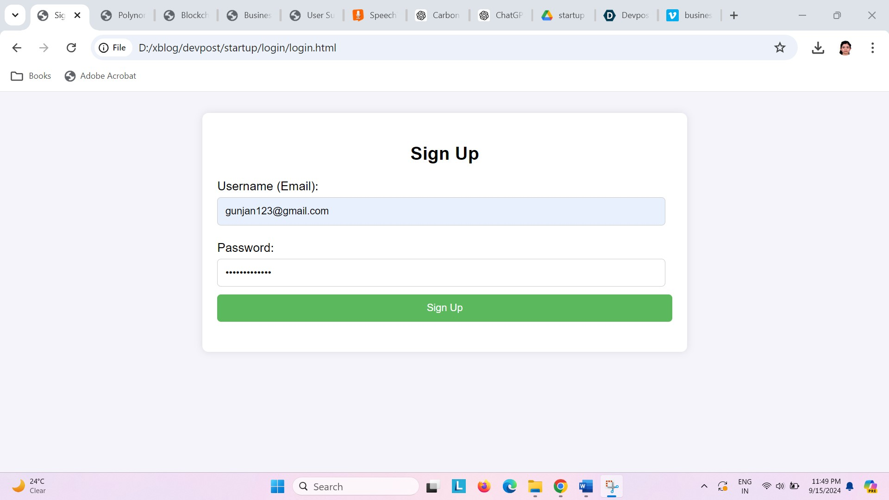
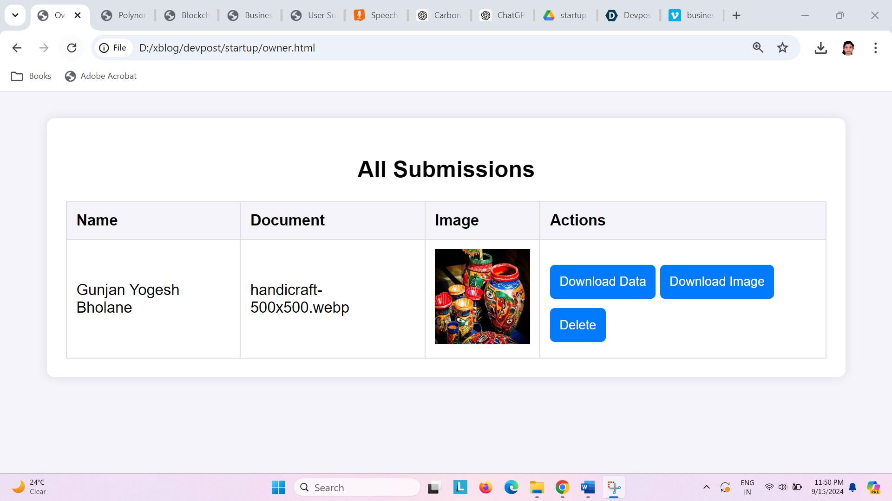

# Profit-Path

## **Inspiration**
The inspiration for Profit-Path stems from the challenges many startups and small businesses face in scaling their operations, maintaining profitability, and staying innovative. With the rise of social media platforms and eCommerce, a large number of new ventures are emerging, yet only a few sustain long-term success. I wanted to create a solution that would help these businesses overcome these challenges by providing comprehensive tools and strategies for growth and sustainability.

## **What it does**
Profit-Path is a comprehensive platform designed to help startups, small to medium-sized enterprises (SMEs), and entrepreneurs achieve growth, innovation, and sustainability. Key features include:

- **Business Growth & Innovation Dashboard**: A centralized platform for managing and tracking business performance and innovation.
- **Startup Idea Exchange**: A marketplace for exchanging and selling business ideas, fostering mutual growth.
- **Growth Tips & Strategies**: Provides actionable advice and insights on emerging trends like blockchain, digital marketing, and technology adoption.
- **Progress & Profit Tracking**: Tools for monitoring business performance, setting growth goals, and tracking profits.
- **Sustainability Tracker**: Monitors and reduces carbon footprints, promoting eco-conscious practices.
- 
- 
- 
- 

## **How I built it**
I utilized advanced technologies, including AI and machine learning, to develop personalized business growth insights and real-time analytics. My Minimum Viable Product (MVP) includes core features such as the idea exchange and profit tracking modules. I integrated cloud computing for scalable and reliable performance.

## **Challenges I ran into**
Some challenges included:

- **Integrating AI-driven insights**: Developing algorithms that provide accurate and actionable business insights required extensive research and testing.
- **Ensuring user engagement**: Designing a user-friendly interface that effectively balances functionality with simplicity was a significant challenge.
- **Expanding sustainability tracking**: Enhancing features to track and reduce carbon footprints while ensuring they meet diverse business needs was complex.

## **Accomplishments that I'm proud of**
- **Successful MVP Launch**: I have launched my MVP with essential features like the idea exchange and profit tracking, receiving positive feedback from early users.
- **Innovative Features**: My platform uniquely combines business innovation, profit tracking, and sustainability, distinguishing it in the competitive landscape.
- **Positive User Impact**: Businesses have successfully utilized my tools to gain actionable insights and improve their performance.

## **What I learned**
I learned the importance of integrating user feedback early in the development process to refine features and enhance user experience. The need for a robust technology stack that supports scalability and real-time analytics was also crucial. Additionally, understanding the balance between innovation and practicality was key to meeting user needs.

## **What's next for Profit-Path**
- **Enhancing AI Capabilities**: I plan to further develop my AI-driven insights to provide even more personalized and actionable business strategies.
- **Expanding Sustainability Features**: Adding more advanced tools for tracking and reducing carbon footprints to support eco-conscious business practices.
- **Market Expansion**: I aim to reach a broader audience, including traditional handcraft businesses in India, helping them modernize and stay competitive.

## **Built With**
- **Blockchain**
- **CSS**
- **HTML**
- **JavaScript**
- **Machine Learning**
